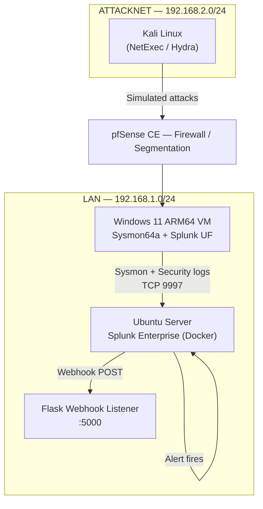

FULL REPORT ON MEDIUM WITH SCREENSHOTS:

https://medium.com/@karimsaminur123/incident-response-and-threat-hunting-with-splunk-7486ae6952c6


# Attack, Detect, Harden: Incident Response Across 9 MITRE ATT&CK Techniques with Splunk and Sysmon

An end-to-end incident response cycle built on top of the [Sysmon/Splunk threat hunting lab](./README.md): nine MITRE ATT&CK techniques simulated from Kali Linux, detected and correlated in Splunk, alerted via a webhook pipeline, worked through a NIST SP 800-61-aligned incident response process, and remediated with real hardening controls — not just detection.

## Overview

Building on the existing home SOC lab (Splunk Enterprise on an Ubuntu/Docker host, a Windows 11 endpoint running Sysmon, Kali Linux as the attack platform, and pfSense for network segmentation), this project closes the loop from **detection** to **response** to **remediation**. Each technique below follows the same three-part structure: the attack that was simulated, how it was detected and correlated in Splunk, and the specific hardening control(s) implemented afterward to reduce or eliminate the underlying exposure.

## Architecture



## Attack, Detection & Hardening Summary


## Incident Response Process

Every incident below was worked through the same [NIST SP 800-61-aligned playbook](./incident-response-playbook.md): **Detection & Analysis → Containment → Eradication → Recovery → Post-Incident Activity**. Full write-ups for each simulated incident are documented individually in [`incident-reports.md`](./incident-reports.md).

## Alerting Pipeline

- Detections are built as **Splunk correlation searches**, saved as scheduled alerts with cron triggers tuned to how frequently each technique's underlying event realistically occurs (5-minute cycles for fast-moving techniques like brute force, 30-minute cycles for slower persistence techniques).
- **Throttling** is applied per-alert (keyed on fields like `Account_Name` and `Source_Network_Address`) so a single sustained attack triggers one notification rather than repeating on every scheduled run.
- Each alert's trigger action posts a JSON payload to a lightweight **Flask webhook listener** running on the Ubuntu host, simulating a SOAR-style automated notification pipeline.

Full alert configuration (schedule, throttle, severity, SPL) for all nine detections is in [`alert-specifications.md`](./alert-specifications.md).

---

## T1110 — Brute Force

**Attack:** NetExec was used to run an SMB brute-force attack against port 445 on the Windows 11 endpoint, targeting an unused local account (`backupuser`) with the `rockyou.txt` wordlist.

**Detection:** Windows Security Event ID 4625 (failed logon) is monitored for 5+ failures against the same account within a 5-minute window — a pattern consistent with password spraying or credential stuffing.
```spl
index=main sourcetype="WinEventLog:Security" EventCode=4625
| bucket _time span=5m
| stats count by _time, Account_Name, Source_Network_Address
| where count>=5
```
Over 1,500 failed login attempts from `192.168.2.20` were confirmed via both the Splunk alert and direct review in Event Viewer, correlating clearly to a sustained brute-force attempt rather than a single mistyped password.

**Mitigation:**
- Firewall rule blocking the offending source at the network boundary (pfSense)
- Enforced a stronger password policy — minimum 12-character length, complexity requirements, and password history (last 5 passwords remembered) via `secpol.msc → Account Policies → Password Policy`

---

## Account Lockout (T1110 — consequence)

**Attack:** The same sustained brute-force attempt against `backupuser` exceeded the configured lockout threshold.

**Detection:** Windows Security Event ID 4740 (account lockout) confirms the defensive threshold was actually crossed — a stronger, lower-noise signal than failed-logon volume alone, since it only fires when the account is genuinely locked out, not on every individual failure.

**Mitigation:**
- Lockout threshold configured (5 attempts / 10-minute window / 10-minute lockout duration) to ensure sustained brute-force attempts are automatically halted
- Noted as a candidate for MFA (e.g., via Okta or Entra ID) as a stronger long-term control than password policy alone

---

## T1059.001 — PowerShell (Encoded Command)

**Attack:** A PowerShell process was launched using `-EncodedCommand` with a base64-encoded payload, simulating the obfuscation technique commonly used in phishing payloads and malicious script delivery.

**Detection:** Sysmon Event ID 1 (process creation) flags PowerShell command lines containing `-EncodedCommand`, `-enc`, or similar obfuscation flags.
```spl
index=main sourcetype="WinEventLog:Microsoft-Windows-Sysmon/Operational" EventCode=1 Image="*powershell.exe"
CommandLine="*-enc*" OR CommandLine="*-EncodedCommand*" OR CommandLine="*-e *"
```

**Mitigation:**
- AppLocker executable rule denying PowerShell execution for standard user accounts (`gpedit.msc → Application Control Policies → AppLocker → Executable Rules`)
- **PowerShell Script Block Logging** enabled, writing the fully decoded script content to Event ID 4104 in the `Microsoft-Windows-PowerShell/Operational` log — closing the visibility gap where an encoded command's actual behavior would otherwise stay hidden

---

## T1204 / T1036 — Suspicious File Execution

**Attack:** An executable was copied into the `Downloads` folder and launched from that location via a PowerShell-spawned process, simulating execution of a downloaded or dropped payload.

**Detection:** Sysmon Event ID 1 flags process execution from non-standard install paths (Downloads, Temp, AppData\Roaming). A follow-up search against Event ID 11 (file creation) corroborated the finding by identifying the file's creation event alongside its execution.

**Mitigation:**
- AppLocker rule denying execution from `%OSDRIVE%\Users\*\AppData\Local\Temp\*.exe` for all users, confirmed by a blocked-execution prompt when tested against a standard user account

---

## T1053.005 — Scheduled Task Creation

**Attack:** A scheduled task was created via `schtasks.exe`, simulating a common persistence technique that re-executes a payload on a defined trigger.

**Detection:** Sysmon Event ID 1 flags any process creation where the image is `schtasks.exe`, capturing the full command line (task name, trigger, and target binary).

**Mitigation:**
- Restricted the **"Log on as a batch job"** user right to Administrators only (`gpedit.msc → User Rights Assignment`), preventing standard users from creating scheduled tasks at all
- Enabled the native **Task Scheduler Operational log** (`Microsoft-Windows-TaskScheduler/Operational`) and added it as a second Splunk input — closing a real blind spot in the original detection, which only caught tasks created via `schtasks.exe` and would have missed tasks created through the Task Scheduler GUI or COM API directly

---

## T1021.002 — SMB Lateral Movement

**Attack:** NetExec was used to generate repeated SMB (port 445) connection attempts against the Windows 11 endpoint, simulating lateral movement via Windows admin shares.

**Detection:** Sysmon Event ID 3 (network connection) monitors for repeated connections to port 445 from a single source.
```spl
index=main sourcetype="WinEventLog:Microsoft-Windows-Sysmon/Operational" EventCode=3 DestinationPort=445
| stats count by SourceIp, DestinationIp
| where count > 3
```
**Key finding:** this detection initially returned zero results despite confirmed, ongoing attack traffic. Investigation traced the gap to the SwiftOnSecurity Sysmon configuration's `NetworkConnect` include rules, which are built entirely around **outbound** connections matched by source process path — inbound SMB traffic from a trusted system process (`svchost.exe`) never matched any inclusion rule and was silently dropped before it ever reached Splunk. Adding an explicit `<DestinationPort name="SMB inbound">445</DestinationPort>` rule to the config's include block closed the gap.

**Mitigation:**
- Firewall rule at pfSense blocking inbound connections on port 445 from the untrusted network segment — confirmed effective via a follow-up Nmap scan and NetExec re-attempt, both of which reported the host as unreachable
- SMB signing enforced (`Set-SmbServerConfiguration -EnableSecuritySignature $true -RequireSecuritySignature $true`) to prevent relay attacks
- SMBv1 disabled

---

## T1547.001 — Registry Run Key Persistence

**Attack:** A value was added to the `HKCU\...\CurrentVersion\Run` autostart key, simulating a persistence mechanism that automatically launches a payload at every user logon.

**Detection:** Sysmon Event ID 13 (registry value set) flags writes to autostart registry locations.

**Mitigation:**
- Registry ACL change denying `Set Value` permission on the target key for standard user accounts, applied via `regedit → Permissions → Advanced`
- Registry auditing (SACL) enabled for the same key, generating a second, independent detection source: Windows Security Event ID 4657, which additionally captures the requesting process, the before/after value change, and the account's LogonId — richer forensic detail than Sysmon's Event ID 13 alone provides
- **Lesson learned:** the audit rule initially failed silently because the configured principal resolved to a specific local account instead of `Everyone`, despite the audit policy itself being correctly enabled — a reminder that security controls need to be validated by testing, not just by confirming they're configured

---

## Privileged Logon Activity (no direct MITRE mapping — operational detection)

**Attack:** Elevated PowerShell sessions were initiated to simulate administrative privilege use, the kind of activity that can also indicate backdoor access, pass-the-hash/pass-the-ticket attacks, or credential dumping when it occurs unexpectedly.

**Detection:** Windows Security Event ID 4672 (special privileges assigned) logs every logon session granted administrative rights.

**Mitigation:**
- Audited the local Administrators group membership and reduced standing admin accounts to only those that require it
- Reviewed and restricted the `SeDebugPrivilege` User Rights Assignment, since this specific privilege is what credential-dumping tools require to access LSASS memory
- Correlated Event ID 4656 (handle requested) against registry key access to validate whether privileged sessions were also touching sensitive persistence locations — this correlation confirmed true positives, distinguishing routine administrative activity from sessions warranting further investigation
- Documented **PAM (Privileged Access Management)** in Active Directory and **PIM (Privileged Identity Management)** in Entra ID as planned future improvements — replacing standing 24/7 privileged access with time-bounded, request-based elevation

---

## T1078 — Off-Hours Logon

**Attack:** Successful logons occurring outside a defined normal working window (before 6 AM or after 8 PM) were used to simulate the use of valid credentials at an anomalous time — a pattern consistent with compromised-credential misuse.

**Detection:** Windows Security Event ID 4624 filtered to logons outside the defined window.

**Mitigation:**
- Applied a logon-hours restriction to the test account (`net user backupuser /times:M-F,9AM-6PM`) — genuine preventive control, since Windows outright rejects authentication attempts outside the allowed window rather than merely logging them afterward
- This produces a distinct, low-noise detection signal: Event ID 4625 with **Sub_Status `0xC000006F`** (logon-hours violation), which is meaningfully stronger than the original clock-based detection since it only fires when the restriction itself is actually triggered — eliminating false positives from legitimate after-hours work

---

## Key Findings

Beyond the individual detections, this project surfaced several findings worth calling out on their own:

1. **Default Sysmon configurations have real, non-obvious blind spots.** The SwiftOnSecurity baseline — a widely trusted community config — silently dropped all inbound SMB connection data because its `NetworkConnect` rules are built around outbound traffic patterns. This was only discovered by testing a real attack against a specific detection, not by reading documentation.
2. **A correctly-configured control can still fail silently.** The registry auditing SACL was enabled and appeared correct, but pointed at the wrong security principal — a reminder that security controls need to be validated through actual testing, not just confirmed as "configured."
3. **Detection and prevention are not the same thing.** Several techniques in this project (privileged logon activity, off-hours logons) are fundamentally detective controls — they observe and alert, but don't block anything on their own. Real prevention required separate, additional controls (logon-hour restrictions, reduced standing privilege, AppLocker rules) layered on top of detection.

## Related Documentation

- [`README.md`](./README.md) — original Sysmon/Splunk lab build, including the ARM64 driver troubleshooting
- [`incident-response-playbook.md`](./incident-response-playbook.md) — the NIST 800-61-aligned response framework
- [`incident-reports.md`](./incident-reports.md) — individual incident write-ups for all nine simulated attacks
- [`mitre-attack-mapping.md`](./mitre-attack-mapping.md) — full technique-to-detection-to-response coverage table
- [`alert-specifications.md`](./alert-specifications.md) — complete alert configuration (SPL, schedule, throttle, severity)
- [`hunt-queries.md`](./hunt-queries.md) — standalone threat hunting queries by technique

## Tools Used

Splunk Enterprise · Sysmon · Windows 11 · pfSense CE · Kali Linux · NetExec · Hydra · Flask · PowerShell · AppLocker · Windows Group Policy / Local Security Policy
