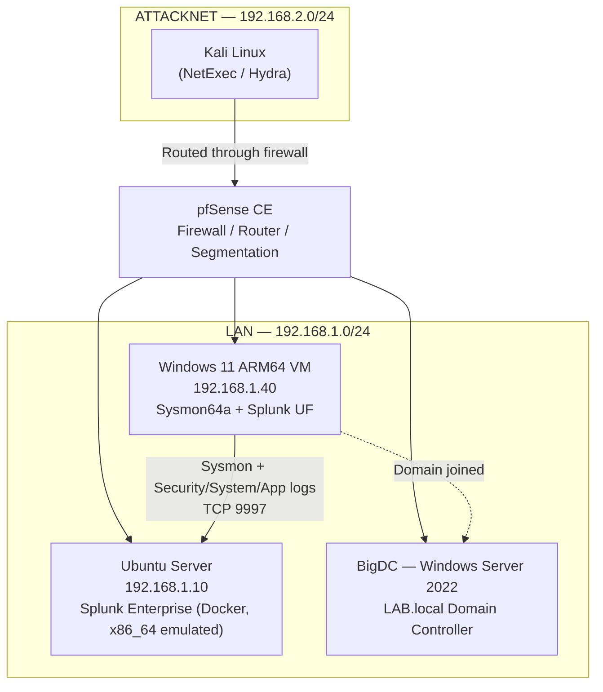

# Windows 11 Endpoint Monitoring Lab — Sysmon + Splunk (ARM64)

Full Report with Screenshots: https://medium.com/@karimsaminur123/splunk-with-microsoft-sysmon-and-windows-security-logs-684ee12b57cb

Deploying Sysmon and the Splunk Universal Forwarder on a Windows 11 ARM64 VM to capture endpoint telemetry (process creation, network connections, registry activity, and authentication events), forwarding it into a self-hosted Splunk Enterprise instance for detection and IAM-focused monitoring.

This project extends an existing home SOC lab (pfSense-segmented network, Snort IDS, Splunk Enterprise on Docker) by adding host-based visibility to complement existing network-layer detection.

## Lab Architecture



**Host:** M3 MacBook Air, virtualization via UTM/QEMU (ARM64)

| Component | Role | Notes |
|---|---|---|
| pfSense CE | Firewall / router | Segments ATTACKNET from LAN so attack traffic is inspectable |
| Windows 11 ARM64 VM | Monitored endpoint | Sysmon64a + Splunk Universal Forwarder (x64, under emulation) |
| Ubuntu Server | Splunk Enterprise host | Docker container, x86_64 emulated via `tonistiigi/binfmt` |
| BigDC (Server 2022) | Domain controller | LAB.local — Windows 11 VM is domain-joined |
| Kali Linux | Attack simulation | NetExec / Hydra for SMB brute-force testing |

## Objectives

- Deploy Sysmon on a Windows 11 **ARM64** host and resolve the architecture-specific driver-loading issues unique to Apple Silicon virtualization
- Forward Sysmon, Security, System, and Application event logs to Splunk via the Universal Forwarder
- Build an IAM-focused Splunk dashboard tracking successful/failed logins, account lockouts, and privileged logon activity
- Simulate an SMB authentication attack from Kali and validate detection end-to-end
- Produce MITRE ATT&CK-mapped threat hunting queries against the collected telemetry

## Key Technical Challenge: Sysmon on ARM64 Windows

The most significant obstacle in this build was getting Sysmon's kernel driver to load at all. The failure presented identically across multiple attempts:

```
StartService failed for SysmonDrv:
This driver has been blocked from loading
```

This error is generic enough that it can point to several unrelated causes, and ruling each one out required checking the OS at increasingly deep levels:

1. **Memory Integrity / HVCI (Core Isolation)** — confirmed disabled (`SecurityServicesRunning: {0}`), not the cause
2. **Microsoft Vulnerable Driver Blocklist** — confirmed disabled via `HKLM:\SYSTEM\CurrentControlSet\Control\CI\Config`, not the cause
3. **Smart App Control** — confirmed **Off** in Windows Security settings, not the cause
4. **Secure Boot / UEFI policy** — investigated via UTM's QEMU firmware settings; `Confirm-SecureBootUEFI` returned `True`, but this also turned out to be a dead end

**Root cause:** `Sysmon64.exe` is an **x64 binary**. Windows 11 on ARM64 can emulate x64 **user-mode** applications, but it **cannot emulate x64 kernel-mode drivers** — Sysmon's core mechanism. No amount of policy or firmware adjustment could fix this, because it wasn't a policy problem at all — it was an architecture mismatch.

**Fix:** Sysinternals ships an ARM64-native binary alongside the standard x86/x64 builds: `Sysmon64a.exe`. Installing with the correct binary resolved the issue immediately:

```powershell
.\Sysmon64a.exe -accepteula -i sysmonconfig-export.xml
```

**Lesson:** on Apple Silicon (or any ARM64 Windows) hosts, always confirm binary architecture *before* troubleshooting OS security policy — kernel-mode components have no emulation path, unlike user-mode applications.

## Splunk Universal Forwarder Notes

- Splunk does **not** ship a native Windows ARM64 Universal Forwarder (as of this build). The standard **x64 Windows UF** was used instead — this works because the Forwarder is entirely user-mode (no kernel driver), so Windows 11's x64 emulation layer handles it without issue.
- The Sysmon Operational log channel has a restrictive default ACL (`O:BAG:SYD:(A;;0xf0007;;;SY)(A;;0x7;;;BA)...(A;;0x1;;;S-1-5-32-573)`) that does not automatically include the Splunk Forwarder's virtual service account (`NT SERVICE\SplunkForwarder`). Security, System, and Application logs forwarded successfully out of the box; Sysmon did not, until the service account was added to the local **Event Log Readers** group:

  ```powershell
  Add-LocalGroupMember -Group "Event Log Readers" -Member "NT SERVICE\SplunkForwarder"
  ```

  A full VM reboot (not just a service restart) was required for the updated group membership to reflect in the service's access token before Sysmon events began forwarding.

### `inputs.conf`

```ini
[WinEventLog://Microsoft-Windows-Sysmon/Operational]
disabled = false
index = main

[WinEventLog://Security]
disabled = false
index = main

[WinEventLog://System]
disabled = false
index = main

[WinEventLog://Application]
disabled = false
index = main
```

## Attack Simulation

An SMB authentication brute-force was run from Kali against the Windows 11 host to generate real detection data.

- **Hydra** was attempted first but failed with `invalid reply from target` — traced to Hydra's SMB module not correctly negotiating SMB signing (`RequireSecuritySignature: True` on the Windows target).
- **NetExec** (successor to CrackMapExec) was used instead, as it correctly handles modern SMB2/3 negotiation and signing, and is the current industry-standard tool for Windows/AD-focused engagements:

  ```bash
  netexec smb 192.168.1.40 -u skarim -p /tmp/wordlist.txt
  ```

Resulting authentication activity (`EventCode=4624` / `4625`) was confirmed flowing into Splunk in real time, validating the full collection pipeline from attack traffic to indexed, searchable event data.


## MITRE ATT&CK Hunt Queries

| Technique | Description | Data Source |
|---|---|---|
| T1110 | Brute Force | Security (4625) |
| T1059.001 | PowerShell (encoded commands) | Sysmon (Event ID 1) |
| T1053.005 | Scheduled Task persistence | Sysmon (Event ID 1) |
| T1021.002 | SMB / lateral movement | Sysmon (Event ID 3) |
| T1078 | Valid Accounts, off-hours logon | Security (4624) |
| T1547.001 | Registry Run key persistence | Sysmon (Event ID 13) |

## Screenshots


## Lessons Learned

- Architecture (ARM64 vs. x64) should be the **first** thing checked when a driver silently fails to load on Apple Silicon virtualization — not the last.
- Default log channel ACLs can silently block a forwarder even when the service account has broad system privileges elsewhere; per-channel permissions need to be checked individually.
- Tooling choice matters for realistic results: older tools (Hydra) can fail against modern protocol security (SMB signing) in ways that look like a configuration problem but are actually a tooling limitation.

## Tools Used

UTM/QEMU · Windows 11 (ARM64) · Sysmon · Splunk Enterprise · Splunk Universal Forwarder · pfSense CE · Kali Linux · NetExec · PowerShell
